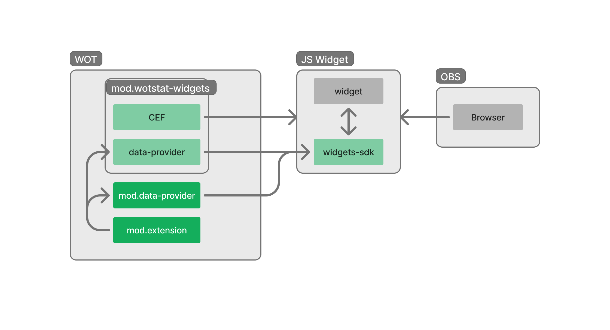

# Data Provider

Легковесный мод для игр World of Tanks и Мир танков, который предоставляет локальным веб-виджетам доступ к событиям игры.



> [!NOTE]
> Копия этого мода уже встроена в [wotstat-widgets](https://github.com/WOT-STAT/wotstat-widgets), если вы делаете виджеты для обычных игроков, им не нужно устанавливать этот мод.

Мод полезен для стримеров, которые хотят встроить виджеты в OBS, и не хотят ставить *тяжелый* `wotstat-widgets`.

Этот мод никак не отображается в игре, не отправляет уведомлений и не добавляет никаких элементов интерфейса.

## Установка
1. Скачай актуальную версию мода из [Releases](https://github.com/WOT-STAT/data-provider/releases/latest)
2. Переместите `.wotmod` файл в папку с актуальной версий игры в `Tanki/mods`. Например `Tanki/mods/1.28.0.0`

## Использование

> [!IMPORTANT]
> Для подключения со стороны JavaScript **рекомендуется** использовать [wotstat-widgets-sdk](https://www.npmjs.com/package/wotstat-widgets-sdk)

```typescript
import { WidgetSDK } from 'wotstat-widgets-sdk'

// инициализация SDK
const sdk = new WidgetSDK()

// подписка на изменение статуса (ожидание открытия игры)
sdk.onStatusChange(status => console.log(status))

// получение текущего танка
const currentTank = sdk.data.hangar.vehicle.info.value
console.log('Current tank:', currentTank)

// подписка на изменение танка
sdk.data.hangar.vehicle.info.watch((newValue, oldValue) => {
  console.log('New tank:', newValue)
  console.log('Old tank:', oldValue)
})

// подписка на получение результата боя
sdk.data.battle.onBattleResult.watch(result => {
  console.log('Battle result:', result)
})
```

Подробнее о методах и событиях смотрите в [репозитории SDK](https://www.npmjs.com/package/wotstat-widgets-sdk)

### Подключение без SDK

Если вы хотите подключиться к моду напрямую, без использования SDK, вам необходимо через WebSocket подключиться к `ws://localhost:33800`.

```typescript
const ws = new WebSocket('ws://localhost:33800')
```

После чего, мод может отправить вам 3 вида сообщений в формате `JSON`

#### InitMessage
Сообщение инициализации, отправляется один раз после подключения и содержит в себе актуальное состояние всех данных в виде массива пар ключ-значение. 
```typescript
type InitMessage = {
  type: 'init',
  states: { path: string, value: any }[]
}
```

#### ChangeStateMessage
Сообщение изменения состояния, отправляется каждый раз, когда какое-либо значение меняется.

```typescript
type ChangeStateMessage = {
  type: 'state',
  path: string,
  value: any
}
```

> Например текущий никнейм игрока
> ```json
> {
>   "type": "state",
>   "path": "player.name",
>   "value": "Renou"
> }
> ```

### TriggerMessage
Сообщение триггера, отправляется каждый раз, когда происходит какое-либо событие. Может содержать дополнительные данные.

```typescript
type TriggerMessage = {
  type: 'trigger',
  path: Path,
  value?: ValueType
}
```

> Например результат боя
> ```json
> {
>   "type": "trigger",
>   "path": "battle.onBattleResult",
>   "value": { <...> }
> }
> ```


## Принцип работы

Мод позволяет создавать состояния `State` и события `Trigger`. Состояния хранят значения и уведомляют об их изменениях. Триггеры позволяют отправлять события, но не хранят значения.

Мод запускает локальный `WebSocket` сервер на порту `33800`, который принимает подключения от внешних виджетов.

После подключения нового клиента, мод отправляет ему все текущие зарегистрированные состояния в виде сообщения `InitMessage`.

При изменении состояния, мод отправляет всем клиентам сообщение `ChangeStateMessage`.

При вызове триггера, мод отправляет всем клиентам сообщение `TriggerMessage`.


## Расширения

Другие моды могут создавать свои состояния и триггеры, их данные будут отправляться по общему каналу связи.

> [!NOTE]
> Полный пример мода-расширения смотрите в [extension-example](./extension-example/README.md)

